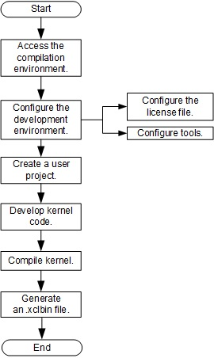
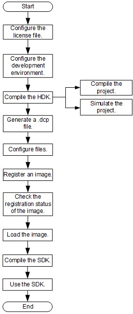
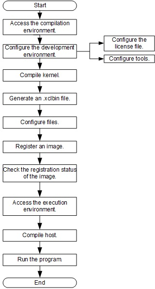

# 目录

+ [1 认识基于FP1平台的FPGA开发套件](#sec_1)
	+ [1.1 关于开发套件](#sec_1_1)
	+ [1.2 使用前准备](#sec_1_2)
+ [2 硬件快速开发指南](#sec_2)
	+ [2.1 高性能架构硬件开发流程](#sec_2_1)
	+ [2.2 通用型架构硬件开发流程](#sec_2_2)
+ [3 软件快速开发指南](#sec_3)
	+ [3.1 环境配置](#sec_3_1)
	+ [3.2 编写与调试用户应用](#sec_3_2)
	+ [3.3 运行用户应用](#sec_3_3)
+ [4 example的使用](#sec_4)
	+ [4.1 SDK的配置和编译](#sec_4_1)
	+ [4.2 使用基于vivado的example](#sec_4_2)
	+ [4.3 使用基于SDAccel的example](#sec_4_3)

# 1 认识基于FP1平台的FPGA开发套件

## 1.1 关于开发套件
基于FP1的FPGA开发套件是一款基于华为企业云服务的FPGA硬件与软件开发工具套件，本套件不仅能够帮助用户完成FPGA相关的设计、仿真、实现以及一键式编译运行，而且还能为用户提供专业的设计以及验证组件，帮助开发者更高效的实现FPGA的开发。基于FP1平台的FPGA开发套件主要分为硬件开发套件和软件开发套件两个部分。硬件开发套件可以帮助用户完成工程编译、工程仿真并最终生成dcp文件或xclbin文件，软件开发套件可以指引用户完成FPGA镜像的注册、FPGA镜像加载以及用户应用的编写和调试。

## 1.2 使用前准备

在使用FPGA开发套件前，需要完成开发套件的下载、配置文件的修改以及FPGA加速云服务器镜像的配置。套件中包含硬件开发套件、软件开发套件、FPGA镜像管理工具和FPGA镜像加载工具。硬件开发套件存放在[hardware](./fp1/hardware)目录下，包括vivado和SDAccel两种开发工具套件；软件开发套件存放在[software](./fp1/software)目录下，包括实例运行时所需要的运行环境配置文件、驱动、工具以及相关应用程序。

### 1.2.1 开发套件的下载

对于https连接执行`git clone https://github.com/Huawei/huaweicloud-fpga.git`命令将开发套件下载到您的本地服务器;

对于ssh连接执行`git@github.com:Huawei/huaweicloud-fpga.git`命令将开发套件下载到您的本地服务器。

> 开发套件的下载依赖git工具，请确保在执行下载操作前已安装此软件。

### 1.2.2 修改配置文件和配置镜像
在注册FPGA镜像和查询FPGA镜像前，需要完成对配置文件的修改以及FPGA加速服务器镜像的配置，配置的具体方法请参考以下链接。 
http://support.huaweicloud.com/usermanual-fpga/zh-cn_topic_0069154765.html

# 2 硬件快速开发指南
用户在选择FPGA加速云服务器类型时，有高性能架构和通用型架构两种类型，对应不同的架构类型有基于vivado的硬件开发流程和基于SDAccel的硬件开发流程。硬件开发流程可以指导用户完成工程创建、工程编译、工程仿真并最终生成dcp或xclbin文件。用户在完成硬件开发后，如果需要基于已生成dcp文件或xclbin开发自己的应用，请参考第3章节内容。

+ [2.1 高性能架构硬件开发流程](#sec_2_1)
+ [2.2 通用型架构硬件开发流程](#sec_2_2)

 
## 2.1 高性能架构硬件开发流程
选择高性能架构时，硬件开发是基于vivado的流程，开发流程如下图所示。

基于vivado的硬件开发详细步骤，请参考[基于vivado的硬件开发流程](./fp1/docs/基于vivado硬件开发流程.md)。

 
## 2.2 通用型架构硬件开发流程
选择通用型架构时，硬件开发是基于SDAccel的流程，开发流程如下图所示。

基于SDAccel的硬件开发详细步骤，请参考[基于SDAccel的硬件开发流程](./fp1/docs/基于SDAccel硬件开发流程.md)。

# 3 软件快速开发指南
如果用户已完成硬件开发，生成了dcp或xclbin文件，则可以按照本章内容完成FPGA用户应用的开发。

+ [3.1 环境配置](#sec_3_1)
+ [3.2 编写与调试用户应用](#sec_3_2)
+ [3.3 运行用户应用](#sec_3_3)

## 3.1 环境配置
环境配置是进行FPGA软件开发的必要步骤，包括编译和安装工具、注册FPGA镜像、查询FPGA镜像以及加载FPGA镜像四个部分。

### 步骤1 FPGA镜像管理工具的编译和安装
FPGA镜像管理工具fisclient是一款跨平台命令行工具，用于FPGA镜像管理，而镜像管理是进行FPGA镜像加载前的必须步骤。通过fisclient，用户可以实现FPGA镜像的注册、删除、查询详情列表等操作。此外，fisclient还提供了FPGA镜像（AEI，Accelerated Engine Image）和弹性云服务器镜像之间的关联关系的管理功能。用户在创建AEI和弹性云服务器镜像之间的关联关系后，可以将弹性云服务器镜像发布到云市场或共享给其他用户。

管理工具的编译和安装请参考[fisclient README](./cli/fisclient/README_CN.md)安装部分。
### 步骤2 注册FPGA镜像
用户使用AEI_Register.sh工具向FPGA镜像管理模块注册FPGA镜像。完成注册后，用户会获得一个FPGA镜像ID，可用于查询FPGA镜像的注册操作是否成功，以及后续的FPGA镜像加载、删除、关联等操作。注册的详细步骤请参考以下资源。

[注册FPGA镜像](./fp1/docs/注册FPGA镜像.md)

### 步骤3 查询FPGA镜像
完成文件配置后，用户通过在Linux操作系统的shell中执行fisclient命令进入fisclient登录界面，根据提示信息输入华为云账户密码，通过校验后进入fisclient命令行。在fisclient命令行中，用户可以执行相应的命令进行FPGA镜像的查询、删除和关联等操作。
如何使用工具进行FPGA镜像查询请参考以下资源。

[fisclient README](./cli/fisclient/README_CN.md)

### 步骤4 FPGA镜像加载工具的编译和安装	
FPGA镜像加载工具FpgaCmdEntry是一款Linux环境下的命令行工具，工具具备FPGA信息查询、镜像加载、加载状态查询和虚拟点灯查询功能，是使用FPGA开发套件进行软件开发的必要工具。

FPGA镜像加载工具的编译和安装请参考[fpga_tool README](./fp1/tools/fpga_tool/README.md)工具的编译和安装章节。

### 步骤5 加载FPGA镜像
如何加载FPGA镜像请参考以下资源。

[加载FPGA镜像](./fp1/tools/fpga_tool/docs/load_an_fpga_image.md)

> 想要获取关于FPGA加载工具的更多信息，请参考[fpga_tool README](./fp1/tools/fpga_tool/README.md) 。

## 3.2 编写与调试用户应用
对于不同的服务器架构，编写和调试用户应用的步骤略有不同。

- 高性能架构开发模式

高性能架构开发模式采用DPDK的架构完成FPGA与处理器的数据交互，编写和调试用户应用的方法请参考[基于DPDK的用户应用开发说明](./fp1/software/app/dpdk_app/README.md)。
如果用户需要修改驱动程序，请参考[基于DPDK的驱动开发说明](./fp1/software/userspace/dpdk_src/README.md)。

- 通用型架构开发模式

通用型架构开发模式采用Xilinx的SDAccel架构完成FPGA与处理器的数据交互，编写和调试用户应用的方法请参考[基于SDAccel的用户应用开发说明](./fp1/software/app/sdaccel_app/README.md)。
如果用户需要修改HAL，请参考[SDAccel模式HAL开发说明](./fp1/software/userspace/sdaccel/README.md)。

## 3.3 运行用户应用

用户在完成FPGA镜像加载和应用编译后，用户可以根据不同的服务器架构类型进入不同的APP目录，并执行编译的APP。

+ 高性能架构开发模式

进入目录[huaweicloud-fpga/fp1/software/app/dpdk_app/bin](./fp1/software/app/dpdk_app/bin)，执行用户程序。

+ 通用型架构开发模式

进入目录[huaweicloud-fpga/fp1/software/app/sdaccel_app](./fp1/software/app/sdaccel_app)，执行用户程序。

# 4 example的使用
FPGA开发套件提供了硬件开发和软件开发的完整示例，用户可以通过示例的使用快速掌握在不同服务器架构类型下的FPGA开发流程。

+ [4.1 SDK的配置和编译](#sec_4_1)
+ [4.2 使用基于vivado的example](#sec_4_2)
+ [4.3 使用基于SDAccel的example](#sec_4_3)

## 4.1 SDK的配置和编译
编译SDK时，不同的FPGA加速云服务器类型编译过程不尽相同。

选择高性能架构时，编译方法见以下资源：[基于vivado工具的SDK配置及编译](./fp1/docs/基于vivado工具的SDK配置及编译.md)。

选择通用型架构时，编译步骤见以下资源：[基于SDAccel工具的SDK配置及编译](./fp1/docs/基于sdaccel工具的SDK配置及编译.md)。

## 4.2 使用基于vivado的example
在高性能服务器架构下，华为FPGA云加速服务为用户提供了三种example。example1主要实现用户逻辑的版本号读取，数据取反测试寄存器和加法器的功能；example2主要实现用户逻辑DMA（Direct Memory Access）环回通道和DDR（DDR SDRAM）读取功能；example3主要实现用户逻辑FMMU（Fpga Mermory Manage Unit）功能。基于vivado的example操作流程如下图所示。

基于vivado的example详细说明请见[使用基于vivado的Example](./fp1/docs/使用基于vivado的Example.md)。

## 4.3 使用基于SDAccel的example
在通用型服务器架构下，华为FPGA云加速服务提供了三种example。example1是一个矢量相加的实例，采用opencl c实现逻辑算法；example2是一个矩阵乘法实例，基于c实现逻辑算法；example3是一个矢量相加的实例，采用rtl来实现其逻辑功能。基于SDAccel的example操作流程如下图所示。

基于SDAccel的example详细说明请见[使用基于SDAccel的Example](./fp1/docs/使用基于SDAccel的Example.md)。

\----End