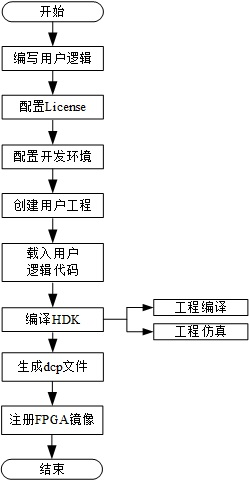
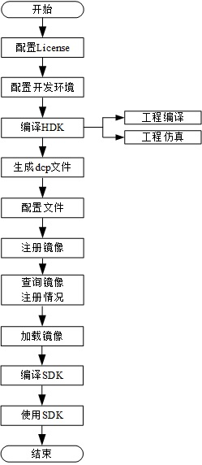
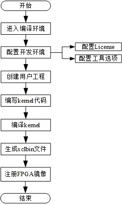

# FPGA开发套件
[Switch to the English version](./README.md)

# 目录

+ [1 认识基于FP1平台的FPGA开发套件](#sec_1)
	+ [1.1 关于开发套件](#sec_1_1)
	+ [1.2 使用前准备](#sec_1_2)
+ [2 高性能架构FPGA开发指南](#sec_2)
	+ [2.1 高性能架构硬件开发流程](#sec_2_1)
	+ [2.2 高性能架构软件开发流程](#sec_2_2)
	+ [2.3 使用基于vivado的Example](#sec_2_3)
+ [3 通用型架构FPGA开发指南](#sec_3)
	+ [3.1 通用型架构硬件开发流程](#sec_3_1)
	+ [3.2 通用型架构软件开发流程](#sec_3_2)
	+ [3.3 使用基于SDAccel的Example](#sec_3_3)

# 1 认识基于FP1平台的FPGA开发套件

## 1.1 关于开发套件
基于FP1的FPGA开发套件是一款基于华为企业云服务的FPGA硬件与软件开发工具套件，支持高性能型和通用型两种架构类型，本套件不仅能够帮助用户完成FPGA相关的设计、仿真、逻辑文件生成以及一键式编译运行，而且还能为用户提供专业的设计以及验证组件，帮助开发者更高效的实现FPGA的开发。基于FP1平台的FPGA开发套件主要分为硬件开发套件和应用开发套件两个部分。硬件开发套件可以帮助用户完成工程编译、工程仿真、生成dcp文件或xclbin文件，最终完成FPGA镜像的注册；应用开发套件可以指引用户完成FPGA镜像加载以及用户应用的编写和调试。

## 1.2 使用前准备
在使用FPGA开发套件前，需要完成开发套件的下载、配置文件的修改以及FPGA加速云服务器镜像的配置。套件中包含硬件开发套件、应用开发套件、FPGA镜像管理工具和FPGA镜像加载工具。硬件开发套件存放在[hardware](./fp1/hardware)目录下，包括vivado和SDAccel两种开发工具套件；应用开发套件存放在[software](./fp1/software)目录下，包括实例运行时所需要的运行环境配置文件、驱动、工具以及相关应用程序。

### 1.2.1 开发套件的下载

+ 对于https连接执行`git clone https://github.com/Huawei/huaweicloud-fpga.git`命令将开发套件下载到您的本地服务器。

+ 对于ssh连接执行`git@github.com:Huawei/huaweicloud-fpga.git`命令将开发套件下载到您的本地服务器。

> 开发套件的下载依赖git工具，请确保在执行下载操作前已安装此软件。

### 1.2.2 修改配置文件并配置镜像
在注册FPGA镜像和查询FPGA镜像前，需要完成对配置文件的修改以及FPGA加速服务器镜像的配置，配置的具体方法请参见 
http://support.huaweicloud.com/usermanual-fpga/zh-cn_topic_0069154765.html

# 2 高性能架构FPGA开发指南
高性能架构FPGA开发包括硬件开发、软件开发和使用Example三个场景。在硬件开发场景下，用户通过使用基于vivado的工具套件完成FPGA镜像文件的生成和注册；在软件开发场景下，用户可基于已有的FPGA镜像文件开发自己的应用；在使用Example时，用户可以通过示例的使用快速掌握在当前服务器架构下的FPGA开发流程。

+ [2.1 高性能架构硬件开发流程](#sec_2_1)
+ [2.2 高性能架构软件开发流程](#sec_2_2)
+ [2.3 使用基于vivado的Example](#sec_2_3)

## 2.1 高性能架构硬件开发流程
用户在选择高性能架构FPGA加速云服务器时，FPGA的硬件开发是基于vivado的硬件开发流程。本流程可以指导用户完成工程创建、工程编译、工程仿真、生成dcp文件并最终完成FPGA镜像（AEI，Accelerated Engine Image）的注册。用户在完成硬件开发后，如果需要基于已注册的FPGA镜像开发自己的应用，参见[2.2节](#sec_2_2)内容。

### 2.1.1 生成dcp文件
基于vivado的dcp文件开发详细步骤，参见[基于vivado的硬件开发流程](./fp1/docs/Implementation Process of Vivado-based Hardware Development_cn.md)。

### 2.1.2 注册FPGA镜像

#### 步骤1 FPGA镜像管理工具的编译和安装
FPGA镜像管理工具fisclient是一款跨平台命令行工具，用于FPGA镜像管理，而镜像管理是进行FPGA镜像加载前的必须步骤。通过fisclient，用户可以实现FPGA镜像的删除、查询等操作。此外，fisclient还提供了FPGA镜像（AEI，Accelerated Engine Image）和弹性云服务器镜像之间关联关系的管理功能。用户在创建AEI和弹性云服务器镜像之间的关联关系后，可以将弹性云服务器镜像发布到云市场或共享给其他用户，从而实现将AEI发布到云市场或共享给其他用户。

管理工具的编译和安装请参见[fisclient README](./cli/fisclient/README_CN.md)安装部分。
#### 步骤2 注册FPGA镜像
用户使用AEI_Register.sh工具向FPGA镜像管理模块注册FPGA镜像。完成注册后，请记录并妥善保存返回结果里的ID，此ID将用于查询FPGA镜像的注册操作是否成功以及后续的软件开发中。注册的详细步骤请参见以下资源。

[注册FPGA镜像](./fp1/docs/Register an FPGA image for a DPDK project_cn.md)

#### 步骤3 查询FPGA镜像
在弹性云服务器中执行`fisclient`命令进入FPGA镜像管理工具fisclient登录界面，根据提示信息输入华为云账户密码，通过校验后进入fisclient命令行。在fisclient命令行中，用户可以执行相应的命令进行FPGA镜像的查询、删除和关联等操作。

如何使用工具进行FPGA镜像查询请参见[fisclient README](./cli/fisclient/README_CN.md)查询部分。

## 2.2 高性能架构软件开发流程
如果用户已完成硬件开发，注册了FPGA镜像，则可以按照本章内容完成FPGA用户应用的开发。

### 2.2.1 加载FPGA镜像
用户在完成FPGA镜像注册后，需要使用FPGA镜像加载工具FpgaCmdEntry将镜像加载到FPGA后才能进行软件开发。

#### 步骤1 FPGA镜像加载工具的编译和安装	
FPGA镜像加载工具FpgaCmdEntry是一款Linux环境下的命令行工具，工具具备FPGA信息查询、镜像加载、加载状态查询和虚拟点灯查询功能，是使用FPGA开发套件进行软件开发的必要工具。

FPGA镜像加载工具的编译和安装请参见[fpga_tool README](./fp1/tools/fpga_tool/README_CN.md)工具的编译和安装章节。

#### 步骤2 加载FPGA镜像
如何加载FPGA镜像请参见以下资源。

[加载FPGA镜像](./fp1/tools/fpga_tool/docs/load_an_fpga_image_cn.md)

> 想要获取关于FPGA加载工具的更多信息，请参见[fpga_tool README](./fp1/tools/fpga_tool/README_CN.md) 。

### 2.2.2 编写与调试用户应用
高性能架构开发模式采用DPDK的架构完成FPGA与处理器的数据交互，编写和调试用户应用的方法请参见[基于DPDK的用户应用开发说明](./fp1/software/app/dpdk_app/README_CN.md)。
如果用户需要修改驱动程序，请参见[基于DPDK的驱动开发说明](./fp1/software/userspace/dpdk_src/README_CN.md)。

### 2.2.3 运行用户应用

用户在完成FPGA镜像加载和应用编译后，进入目录[huaweicloud-fpga/fp1/software/app/dpdk_app/bin](./fp1/software/app/dpdk_app/bin)，执行用户程序。

## 2.3 使用基于vivado的Example
在高性能服务器架构下，华为FPGA云加速服务为用户提供了三种Example。Example1主要实现用户逻辑的版本号读取，数据取反测试寄存器和加法器的功能；Example2主要实现用户逻辑DMA（Direct Memory Access）环回通道和DDR（DDR SDRAM）读取功能；Example3主要实现用户逻辑FMMU（Fpga Mermory Manage Unit）功能。基于vivado的Example操作流程如下图所示。

基于vivado的Example详细说明请见[使用基于vivado的Example](./fp1/docs/Using a Vivado-based Example_cn.md)。

# 3 通用型架构FPGA开发指南
通用型架构架构FPGA开发包括硬件开发、软件开发和使用Example三个场景。在硬件开发场景下，用户通过使用基于SDAccel的工具套件完成FPGA镜像文件的生成和注册；在软件开发场景下，用户可基于已有的FPGA镜像文件开发自己的应用；在使用Example时，用户可以通过示例的使用快速掌握在当前服务器架构下的FPGA开发流程。

+ [3.1 通用型架构硬件开发流程](#sec_3_1)
+ [3.2 通用型架构软件开发流程](#sec_3_2)
+ [3.3 使用基于SDAccel的Example](#sec_3_3)

## 3.1 通用型架构硬件开发流程
用户在选择通用型架构时，硬件开发是基于SDAccel的流程。本流程可以指导用户完成工程创建、工程编译、工程仿真、生成xclbin文件，最终完成FPGA镜像（AEI，Accelerated Engine Image）的注册。用户在完成硬件开发后，如果需要基于已注册的FPGA镜像开发自己的应用，请参见3.2节内容。

### 3.1.1 生成xclbin文件
基于SDAccel的xclbin文件开发详细步骤，请参见[基于SDAccel的硬件开发流程](./fp1/docs/Implementation Process of SDAccel-based Hardware Development_cn.md)。

### 3.1.2 注册FPGA镜像
注册FPGA镜像依赖镜像管理工具Fisclient，请参照[2.1.2](#sec_2_1_2)节步骤1完成镜像管理工具的安装。在工具安装成功后，用户使用AEI_Register.sh工具向FPGA镜像管理模块注册FPGA镜像。注册的详细步骤请参见[注册FPGA镜像](./fp1/docs/Register an FPGA image for an OpenCL project_cn.md)。完成注册后，请记录并妥善保存返回结果里的ID，此ID将用于查询FPGA镜像的注册操作是否成功以及后续的软件开发中。
> 用户可以使用Fisclient对注册结果进行查询，具体查询步骤参见[2.1.2](#sec_2_1_2)节步骤3。

## 3.2 通用型架构软件开发流程

如果用户已完成硬件开发，注册了FPGA镜像，则可以按照本章内容完成FPGA用户应用的开发。

### 3.2.1 加载FPGA镜像
加载FPGA镜像时进行FPGA软件开发的必要步骤，如何加载请参见[2.2.1](#sec_2_2_1)节内容。

### 3.2.2 编写与调试用户应用
通用型架构开发模式采用Xilinx的SDAccel架构完成FPGA与处理器的数据交互，编写和调试用户应用的方法请参见[基于SDAccel的用户应用开发说明](./fp1/software/app/sdaccel_app/README_CN.md)。
如果用户需要修改HAL，请参见[SDAccel模式HAL开发说明](./fp1/software/userspace/sdaccel/README_CN.md)。

### 3.2.3 运行用户应用

用户在完成FPGA镜像加载和应用编译后，进入目录[huaweicloud-fpga/fp1/software/app/sdaccel_app](./fp1/software/app/sdaccel_app)，执行用户程序。

## 3.3 使用基于SDAccel的Example
在通用型服务器架构下，华为FPGA云加速服务提供了三种Example。Example1是一个矢量相加的实例，采用opencl c实现逻辑算法；Example2是一个矩阵乘法实例，基于c实现逻辑算法；Example3是一个矢量相加的实例，采用rtl来实现其逻辑功能。基于SDAccel的Example操作流程如下图所示。

基于SDAccel的Example详细说明请见[使用基于SDAccel的Example](./fp1/docs/Using an SDAccel-based Example_cn.md)。

\----End